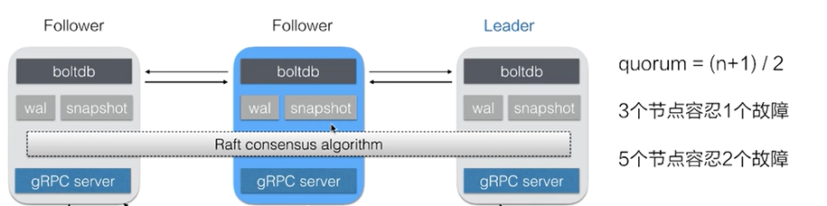
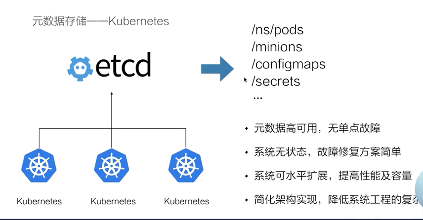
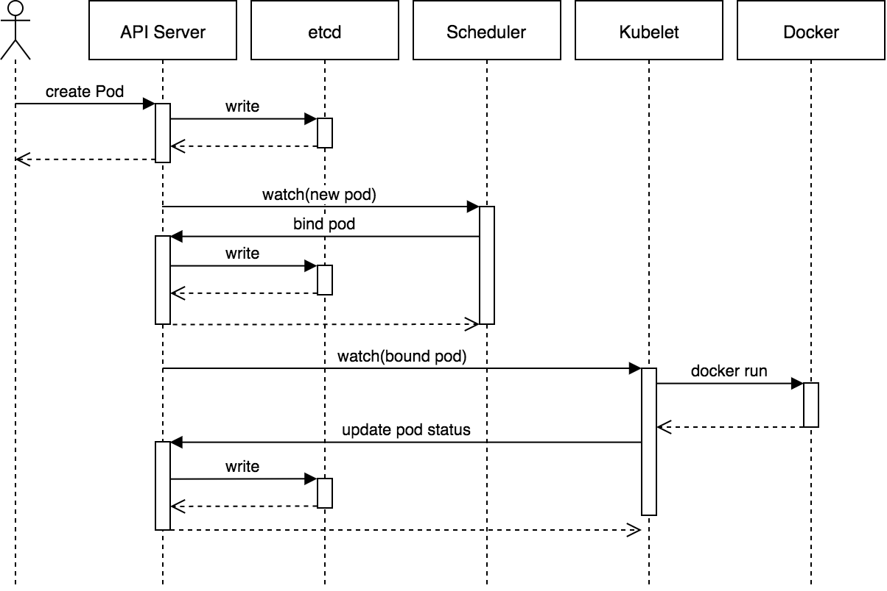

# 1. etcd

> https://doczhcn.gitbook.io/etcd/index


## 1. 定义

```
etcd 是一个分布式、可靠 key-value 存储的分布式系统。当然，它不仅仅用于存储，还提供共享配置及服务发现。
```


## 2. 特点

etcd 特点：

```
简单：安装配置简单，而且提供了 HTTP API 进行交互，使用也很简单
安全：支持 SSL 证书验证
快速：根据官方提供的 benchmark 数据，单实例支持每秒 2k+ 读操作
键值对存储：将数据存储在分层组织的目录中，如同在标准文件系统中
监测变更：监测特定的键或目录以进行更改，并对值的更改做出反应
可靠：采用 raft 算法，实现分布式系统数据的可用性和一致性

etcd 采用 Go 语言编写，它具有出色的跨平台支持，很小的二进制文件和强大的社区。 etcd 机器之间的通信通过 Raft 算法处理
```

etcd 和 zk对比：

```
一致性协议： etcd 使用 Raft 协议，Zookeeper 使用 ZAB（类PAXOS协议），前者容易理解，方便工程实现；
运维方面：etcd 方便运维，Zookeeper 难以运维；
数据存储：etcd 多版本并发控制（MVCC）数据模型 ， 支持查询先前版本的键值对
项目活跃度：etcd 社区与开发活跃，Zookeeper 感觉已经快死了；
API：etcd 提供 HTTP+JSON, gRPC 接口，跨平台跨语言，Zookeeper 需要使用其客户端；
访问安全方面：etcd 支持 HTTPS 访问，Zookeeper 在这方面缺失；	
```


## 3. 使用场景(***)

> https://zhuanlan.zhihu.com/p/143564728
>
> https://www.jianshu.com/p/d63265949e52

```
1. 服务注册与发现
	a.强一致性、高可用的服务存储目录。
		基于 Raft 算法的 etcd 天生就是这样一个强一致性、高可用的服务存储目录。	
	b.一种注册服务和服务健康状况的机制。
		用户可以在 etcd 中注册服务，并且对注册的服务配置 key TTL，定时保持服务的心跳以达到监控健康状态的效果。
	c.一种查找和连接服务的机制。
		通过在 etcd 指定的主题下注册的服务也能在对应的主题下查找到。为了确保连接，我们可以在每个服务机器上都部署一个 Proxy 模式的 etcd，这样就可以确保访问 etcd 集群的服务都能够互相连接。

	etcd2 中引入的 etcd/raft 库，是目前最稳定、功能丰富的开源一致性协议之一。作为 etcd、TiKV、CockcorachDB、Dgraph 等知名分布式数据库的核心数据复制引擎，etcd/raft 驱动了超过十万个集群，是被最为广泛采用一致性协议实现之一。etcd3 中引入的多版本控制、事务等功能，大大的简化了分布式应用的开发流程，提高了效率和稳定性。经过 5 年的演进，etcd 也已经成为了各种容器编排系统的默认存储选项。Kubernetes 是流行的容器平台，运行在任何环境的 Kubernetes 集群都依赖 etcd 来提供稳定而可靠的存储服务。
    
2. key-value 存储(配置管理)
	采用kv型数据存储，一般情况下比关系型数据库快。
    支持动态存储(内存)以及静态存储(磁盘)。
    分布式存储，可集成为多节点集群。
    存储方式，采用类似目录结构。
    只有叶子节点才能真正存储数据，相当于文件。
    叶子节点的父节点一定是目录，目录不能存储数据。

    etcd leader 的延迟是要跟踪的最重要的指标，并且内置仪表板具有专用于此的视图。在我们的测试中，严重的延迟会在群集内造成不稳定，因为 Raft 的速度仅与大多数机器中最慢的机器一样快。我们可以通过适当地调整群集来缓解此问题。etcd 已在具有高度可变网络的云提供商上进行了预调。
    
    /config
    	/database
    /feature-flags
    	/verbose-logging
    	/redesign

    
3. 消息发布与订阅    分布式队列
4. 分布式通知与协调  应用调度
5. 分布式锁
6. leader选举 (master-slave中master挂了，能选举新的master, 相比于负载，不存在调度到有问题节点)
7. 集群监控


nacos(配置管理)+mq(消息发布订阅) + notify(通知和调度)+ redis(kv、分布式锁)+ zk(服务注册发现)

注意：不能把它当成mysql使用，通常用来存储少量重要的数据，存储不能超过1000个历史数据
```


## 4. 原理(***)

> https://zhuanlan.zhihu.com/p/29692778     源码分析	
>
> https://blog.csdn.net/weixin_43809223/article/details/108305812  源码分析
>
> https://www.jianshu.com/p/5aed73b288f7    推荐看





```
1. 如何保证一致性
	raft共识算法
	
	http://thesecretlivesofdata.com/raft/
	1.leader节点的选举	
	2.日志的复制与同步 （binlog, wal + snapshot(加入新节点时用到)) 
	
2. 数据模型
	etcd 的设计目标是用来存放 ***非频繁更新*** 的数据，提供可靠的Watch插件，它暴露了键值对的历史版本，以支持低成本的快照、监控历史事件。这些设计目标要求它使用一个持久化的、多版本的、支持并发的数据数据模型。 (boltdb通过b+tree 存储key的历史版本信息，单机的支持事务的kv数据库)
    当 etcd 键值对的新版本保存后，先前的版本依然存在。从效果上来说，键值对是不可变的，etcd 不会对其进行 in-place 的更新操作，而总是生成一个新的数据结构。为了防止历史版本无限增加，etcd 的存储支持压缩（Compact）以及删除老旧版本。
    
    逻辑视图
    	
    物理视图
    	b+ tree
    	
    	内存中 b+ tree  key     ->  revision
    	磁盘中 b+ tree  revision -> value
```

```
常用术语：
term:   选取任期，每次选取之后都会增加
revision: 全局单调递增
keyvalue:
	create_revision
	mod_revision
	version
	
vote:   选取时的一张票
entry:  raft算法的日志的一个条目
candidate: 候选人，参与竞选以期成为下一期的leader的节点
leader :   
follower:
commit:  提交，持久化数据写入到日志中
propose: 提议，请求大部分节点同意数据写入
```

```
https://www.jianshu.com/p/5aed73b288f7

三种角色： 
leader
对客户端通信的入口，对内数据同步的发起者，一个集群通常只有一个leader节点
follower:
非leader的节点，被动的接受来自leader的数据请求
candidate:
一种临时的角色，只存在于leader的选举阶段，某个节点想要变成leader，那么就发起投票请求，同时自己变成candidate。如果选举成功，则变为candidate，否则退回为follower

数据提交过程：
每次有数据更新的时候产生二阶段提交（two-phase commit）。在leader收到数据操作的请求，先不着急更新本地数据（数据是持久化在磁盘上的），而是生成对应的log，然后把生成log的请求广播给所有的follower

每个follower在收到请求之后有两种选择：一种是听从leader的命令，也写入log，然后返回success回去；另一种情况，在某些条件不满足的情况下，follower认为不应该听从leader的命令，返回false

leader先写log， 告诉所有的follower准备提交数据，先和我一样写log，然后回到leader，此时如果超过半数的follower都成功写了log，那么leader开始第二阶段的提交：正式写入数据，然后同样广播给follower，follower也根据自身情况选择写入或者不写入并返回结果给leader； leader先写持久化自己的数据，然后告诉follower也开始持久化数据，最终所有节点的数据达成一致


选举的过程：
每个follower内部都维护了一个随机的timer， 在timer时间到了的时候还没有人主动联系它的话，那它就要变成candidate，同时发出投票请求（RequestVote）给其他人，每个follower一轮只能投一次票给一个candidate，对于相同条件的candidate，follower们采取先来先投票的策略。如果超过半数的follower都认为他是合适做领导的，那么恭喜，新的leader产生了 

但是如果很不幸，没有人愿意选这个悲剧的candidate，那它只有老老实实的变回小弟的状态。

选举完成之后，leader靠什么来确保小弟是跟着我的呢？答案是定时发送心跳检测(heart beat)。小弟们也是通过心跳来感知大哥的存在的

同样的，如果在timer期间内没有收到大哥的联络，这时很可能大哥已经跪了，所有小弟又开始蠢蠢欲动，新的一轮(term)选举开始了


几个问题：
1. 选举时产生的问题
	在分布式的环境里，每个follower节点存储的数据是不一样的，考虑一下下图的情况，在这些节点经历了一些损坏和恢复。此时S4(2 3 3 7 7 7 )想当leader，但是如果S4成功当选的话，根据leader为上的原则，S4的log在index为4-7的数据，会覆盖掉S2和S3（2 3 3 8 8 8）的8， 如何解决这样的冲突的问题呢？
	第一种是S4在变为大哥之前，先向所有的小弟拿数据来保证自己数据是最全的；
	第二种方法是其他小弟遇到这样资历不足的大哥想上位的时候，完全不予以理睬
	
	Raft算法认为第一种策略过于复杂，所以选择了第二种，保证数据只从leader流向follower， S4在vote请求中会带上自身数据的描述信息，包括：
    1. term，自身处于的选举周期
    2. lastLogIndex，log中最新的index值
    3. lastLogTerm，log中最近的index是在哪个term中产生的

S2和S3在收到vote请求时候会和自身的情况进行对比，每个节点保存的数据信息包括：
	 1.currentTerm，节点处于的term号
     2.log[ ]，自身的log集合
     3.commitIndex，log中最后一个被提交的index值

对比的原则有：
1.如果term < currentTerm，也就是说candidate的版本还没我新，返回 false
2.如果已经投票给别的candidate了（votedFor），则返回false
3.log匹配，如果和自身的log匹配上了，则返回true

这个log匹配原则（Log Matching Property）具体是：
如果在不同日志中的两个条目有着相同的索引和任期号，则它们所存储的命令是相同的。
如果在不同日志中的两个条目有着相同的索引和任期号，则它们之间的所有条目都是完全一样的。

这样就可以一直等到含有最新数据的candidate被选上，从而保证领导人完全原则


2. 数据更新问题
现在新的一届leader选举出来了，虽然选举的过程保证了leader的数据是最新的，但是follower中的数据还是可能存在不一致的情况，这就需要一个补偿机制来纠正这个问题。

S3会给S4发心跳请求(一种名叫AppendEntries请求的特殊格式，entries为空)，其中携带一些数据信息，包括，

term	prevIndex	prevTerm	entries	commitIndex
11	    6	         8	        [ ]	     6

S4在接收到该请求之后会做一致性的判断，规则包括，

1.如果 term < currentTerm返回 false
2.如果在prevLogIndex处的log的term号与prevLogTerm不匹配时，返回 false
3.如果一条已经存在的log与新的冲突（index相同但是term号不同），则删除已经存在的日志和它之后所有的日志，返回true
4.添加任何在已有的log中不存在的index，返回true
5.如果请求中leader的commitIndex > 自身的commitIndex，则比较leader的commitIndex和最新log index，将其中较小的赋给自身的commitIndex

结果与规则2不符合，返回false给S3。这时S3需要做一次退让，修改保存的nextIndex数组，将S4的nextIndex退化为6


再次发送AppendEntries询问S4

term	prevIndex	prevTerm	entries	commitIndex
11	    5	        8	         [ ]	5
如此循环的退让，一直到nextIndex减小到4


S3此时发送的请求为，
term	prevIndex	prevTerm	entries	commitIndex
11	3	3	[ ]	3

S4和自己的log匹配成功，返回true，并告诉leader，当前的matchIndex等于3。S3收到之后更新matchIndex数组，
            S1	S2	S4	S5
nextIndex	7	7	4	7
matchIndex	0	6	3	0

S4和自己的log匹配成功，返回true，并告诉leader，当前的matchIndex等于3。S3收到之后更新matchIndex数组，
			S1	S2	S4	S5
nextIndex	7	7	4	7
matchIndex	0	6	3	0

并发送从nextIndex之后的数据(entries)，
term	prevIndex	prevTerm	entries	commitIndex
11	    3	        3	        [8]	     4

S4再根据覆盖的原则，把自身的数据追平leader，并抛弃之后的数据。

这样消息往复，数据最终一致。


3. 一些其他问题
还有一些值得注意的特殊情况，比如log的清理。log是以追加的方式递增的，随着系统的不断运行，log会越来越大。Raft通过log的snapshot方式，可以定期压缩log为一个snapshot，并且清除之前的log。压缩的具体策略可以参考原论文。


总结：
Raft是一种基于leader选举的算法，用于保证分布式数据的一致性。所有节点在三个角色（leader, follower和candidate）之中切换。选举阶段candidate向其他节点发送vote请求，但是只有包括所有最新数据的节点可以变为leader。

在数据同步阶段，leader通过一些标记（commitIndex，term，prevTerm，prevIndex等等）与follower不断协商最终达成一致。当有新的数据产生时，采用二阶段（twp-phase）提交，先更新log，等大多数节点都做完之后再正式提交数据。
```


## 5. 搭建

```
https://doczhcn.gitbook.io/etcd/index

$ wget https://github.com/coreos/etcd/releases/download/v3.1.5/etcd-v3.1.5-linux-amd64.tar.gz
$ tar xzvf etcd-v3.1.5-linux-amd64.tar.gz
$ mv etcd-v3.1.5-linux-amd64 /opt/etcd


./etcd

name表示节点名称，默认为default。
data-dir 保存日志和快照的目录，默认为当前工作目录default.etcd/目录下。
在http://localhost:2380和集群中其他节点通信。
在http://localhost:2379提供HTTP API服务，供客户端交互。
heartbeat为100ms，该参数的作用是leader多久发送一次心跳到
followers，默认值是100ms。
election为1000ms，该参数的作用是重新投票的超时时间，如果follow在该+ 时间间隔没有收到心跳包，会触发重新投票，默认为1000ms。
snapshot count为10000，该参数的作用是指定有多少事务被提交时，触发+ 截取快照保存到磁盘。
集群和每个节点都会生成一个uuid。
启动的时候会运行raft，选举出leader。
上面的方法只是简单的启动一个etcd服务，但要长期运行的话，还是做成一个服务好一些。下面将以systemd为例，介绍如何建立一个etcd服务。


创建systemd服务
	建立相关目录
		mkdir -p /var/lib/etcd/
		mkdir -p /opt/etcd/config/
		
     创建etcd配置文件
         cat <<EOF | sudo tee /opt/etcd/config/etcd.conf
         ETCD_NAME=$(hostname -s)
         ETCD_DATA_DIR=/var/lib/etcd
         EOF
         
     创建systemd配置文件
     	cat <<EOF | sudo tee /etc/systemd/system/etcd.service
[Unit]
Description=Etcd Server
Documentation=https://github.com/coreos/etcd
After=network.target

[Service]
User=root
Type=notify
EnvironmentFile=-/opt/etcd/config/etcd.conf
ExecStart=/opt/etcd/etcd
Restart=on-failure
RestartSec=10s
LimitNOFILE=40000

[Install]
WantedBy=multi-user.target
EOF	

启动etcd
	systemctl daemon-reload && systemctl enable etcd && systemctl start etcd	
```


## 6. 操作

> https://www.jianshu.com/p/f68028682192

```
etcd --version
etcdctl -h

常用命令选项:
	--debug 输出CURL命令，显示执行命令的时候发起的请求
    --no-sync 发出请求之前不同步集群信息
    --output, -o 'simple' 输出内容的格式(simple 为原始信息，json 为进行json格式解码，易读性好一些)
    --peers, -C 指定集群中的同伴信息，用逗号隔开(默认为: "127.0.0.1:4001")
    --cert-file HTTPS下客户端使用的SSL证书文件
    --key-file HTTPS下客户端使用的SSL密钥文件
    --ca-file 服务端使用HTTPS时，使用CA文件进行验证
    --help, -h 显示帮助命令信息
    --version, -v 打印版本信息


数据库操作围绕对键值和目录的CRUD完整生命周期的管理。

etcd在键的组织上采用了层次化的空间结构(类似于文件系统中目录的概念)，用户指定的键可以为单独的名字，如:testkey，此时实际上放在根目录/下面，也可以为指定目录结构，如/cluster1/node2/testkey，则将创建相应的目录结构。

注：CRUD即Create,Read,Update,Delete是符合REST风格的一套API操作。
```

### V2

#### 1.  set 

```
$ etcdctl set /testdir/testkey "Hello world"
Hello world


支持的选项包括：
--ttl             '0' 该键值的超时时间(单位为秒)，不配置(默认为0)则永不超时
--swap-with-value value 若该键现在的值是value，则进行设置操作
--swap-with-index '0'   若该键现在的索引值是指定索引，则进行设置操作
```


#### 2. get 

```
$ etcdctl get /testdir/testkey
Hello world

当键不存在时，则会报错。例如：
$ etcdctl get /testdir/testkey2
Error:  100: Key not found (/testdir/testkey2) [5]

支持的选项为:
--sort 对结果进行排序
--consistent 将请求发给主节点，保证获取内容的一致性。
```

#### 3. update

```
当键存在时，更新值内容。例如：
$ etcdctl update /testdir/testkey "Hello"
Hello


当键不存在时，则会报错。例如:
$ etcdctl update /testdir/testkey2 "Hello"
Error:  100: Key not found (/testdir/testkey2) [6]

支持的选项为:
--ttl '0' 超时时间(单位为秒)，不配置(默认为 0)则永不超时。
```


#### 4. rm

```
删除某个键值。例如:
$ etcdctl rm /testdir/testkey
PrevNode.Value: Hello

当键不存在时，则会报错。例如:
$ etcdctl rm /testdir/testkey
Error:  100: Key not found (/testdir/testkey) [7]

支持的选项为：
--dir 如果键是个空目录或者键值对则删除
--recursive 删除目录和所有子键
--with-value  检查现有的值是否匹配
--with-index '0'检查现有的index是否匹配
```

#### 5. mk

```
如果给定的键不存在，则创建一个新的键值。例如:
$ etcdctl mk /testdir/testkey "Hello world"
Hello world

当键存在的时候，执行该命令会报错，例如:
$ etcdctl mk /testdir/testkey "Hello world"
Error:  105: Key already exists (/testdir/testkey) [8]

支持的选项为:
--ttl '0'  超时时间(单位为秒），不配置(默认为 0)。则永不超时
```


#### 6. mkdir

```
如果给定的键目录不存在，则创建一个新的键目录。例如：
$ etcdctl mkdir testdir2

当键目录存在的时候，执行该命令会报错，例如：
$ etcdctl mkdir testdir2
Error:  105: Key already exists (/testdir2) [9]

支持的选项为：
--ttl '0' 超时时间(单位为秒)，不配置(默认为0)则永不超时。
```

#### 7. setdir

```
创建一个键目录。如果目录不存在就创建，如果目录存在更新目录TTL。
$ etcdctl setdir testdir3

支持的选项为:
--ttl '0' 超时时间(单位为秒)，不配置(默认为0)则永不超时。
```

#### 8. updatedir

```
更新一个已经存在的目录。
$ etcdctl updatedir testdir2

支持的选项为:
--ttl '0' 超时时间(单位为秒)，不配置(默认为0)则永不超时。
```

#### 9. rmdir

```
删除一个空目录，或者键值对。
$ etcdctl setdir dir1
$ etcdctl rmdir dir1

若目录不空，会报错:
$ etcdctl set /dir/testkey hi
hi
$ etcdctl rmdir /dir
Error:  108: Directory not empty (/dir) [17]
```

#### 10. ls

```
列出目录(默认为根目录)下的键或者子目录，默认不显示子目录中内容。
例如：
$ etcdctl ls
/testdir
/testdir2
/dir

$ etcdctl ls dir
/dir/testkey

支持的选项包括:
--sort 将输出结果排序
--recursive 如果目录下有子目录，则递归输出其中的内容
-p 对于输出为目录，在最后添加/进行区分
```


#### 11. backup

```
备份etcd的数据。
$ etcdctl backup --data-dir /var/lib/etcd  --backup-dir /home/etcd_backup

支持的选项包括:
--data-dir  etcd的数据目录
--backup-dir 备份到指定路径
```

#### 12. watch

```
监测一个键值的变化，一旦键值发生更新，就会输出最新的值并退出。

例如:用户更新testkey键值为Hello watch。
$ etcdctl get /testdir/testkey
Hello world
$ etcdctl set /testdir/testkey "Hello watch"
Hello watch
$ etcdctl watch testdir/testkey
Hello watch

支持的选项包括:
--forever  一直监测直到用户按CTRL+C退出
--after-index '0' 在指定index之前一直监测
--recursive 返回所有的键值和子键值
```

#### 13. exec-watch

```
监测一个键值的变化，一旦键值发生更新，就执行给定命令。

例如：用户更新testkey键值。
$ etcdctl exec-watch testdir/testkey -- sh -c 'ls'
config  Documentation  etcd  etcdctl  README-etcdctl.md  README.md  READMEv2-etcdctl.md'

支持的选项包括:
--after-index '0' 在指定 index 之前一直监测
--recursive 返回所有的键值和子键值
```

#### 14. member

```
通过list、add、remove命令列出、添加、删除etcd实例到etcd集群中。

查看集群中存在的节点
$ etcdctl member list
8e9e05c52164694d: name=dev-master-01 peerURLs=http://localhost:2380 clientURLs=http://localhost:2379 isLeader=true

删除集群中存在的节点
$ etcdctl member remove 8e9e05c52164694d
Removed member 8e9e05c52164694d from cluster

向集群中新加节点
$ etcdctl member add etcd3 http://192.168.1.100:2380
Added member named etcd3 with ID 8e9e05c52164694d to cluster
```


### V3


#### 1.  put

```
应用程序通过 put 将 key 和 value 存储到 etcd 集群中。每个存储的密钥都通过 Raft 协议复制到所有 etcd 集群成员，以实现一致性和可靠性。

这里是设置键的值的命令 foo 到 bar：
$ etcdctl put foo bar
OK
```

#### 2. get

> echo xx | base64 -d 

```
应用程序可以从一个 etcd 集群中读取 key 的值。

假设 etcd 集群已经存储了以下密钥：
foo = bar
foo1 = bar1
foo2 = bar2
foo3 = bar3
a = 123
b = 456
z = 789


读取键为 foo 的命令：
$ etcdctl get foo
foo  // key
bar  // value

上面同时返回了 key 和 value，怎么只读取 key 对应的值呢：
$ etcdctl get foo --print-value-only
bar

以十六进制格式读取键为foo的命令：
$ etcdctl get foo --hex
\x66\x6f\x6f
\x62\x61\x72


查询可以读取单个key，也可以读取一系列key：
$ etcdctl get foo foo3
foo
bar
foo1
bar1
foo2
bar2
请注意，foo3由于范围超过了半开放时间间隔 [foo, foo3)，因此不包括在内foo3。


按前缀读取：
$ etcdctl get --prefix foo
foo
bar
foo1
bar1
foo2
bar2
foo3
bar3


按结果数量限制读取
$ etcdctl get --limit=2 --prefix foo
foo
bar
foo1
bar1


读取大于或等于指定键的字节值的键：
$ etcdctl get --from-key b
b
456
z
789


应用程序可能希望通过访问早期版本的 key 来回滚到旧配置。由于对 etcd 集群键值存储区的每次修改都会增加一个 etcd 集群的全局修订版本，因此应用程序可以通过提供旧的 etcd 修订版来读取被取代的键。

假设一个 etcd 集群已经有以下 key：
foo = bar         # revision = 2
foo1 = bar1       # revision = 3
foo = bar_new     # revision = 4
foo1 = bar1_new   # revision = 5

以下是访问以前版本 key 的示例：
$ etcdctl get --prefix foo # 访问最新版本的key
foo
bar_new
foo1
bar1_new

$ etcdctl get --prefix --rev=4 foo # 访问第4个版本的key
foo
bar_new
foo1
bar1

$ etcdctl get --prefix --rev=3 foo #  访问第3个版本的key
foo
bar
foo1
bar1

$ etcdctl get --prefix --rev=2 foo #  访问第3个版本的key
foo
bar

$ etcdctl get --prefix --rev=1 foo #  访问第1个版本的key
```

#### 3. del

```
应用程序可以从一个 etcd 集群中删除一个 key 或一系列 key。

假设一个 etcd 集群已经有以下key：
foo = bar
foo1 = bar1
foo3 = bar3
zoo = val
zoo1 = val1
zoo2 = val2
a = 123
b = 456
z = 789

删除 key 为 foo 的命令：
$ etcdctl del foo
1

删除 key 为 foo 的命令：
$ etcdctl del foo
1

删除键值对的命令：
$ etcdctl del --prev-kv zoo
1
zoo
val

删除从 foo 到 foo9 的命令：
$ etcdctl del foo foo9
2

删除具有前缀的键的命令：
$ etcdctl del --prefix zoo
2

删除大于或等于键的字节值的键的命令:
$ etcdctl del --from-key b
2
```


#### 4. watch

```
应用程序可以使用watch观察一个键或一系列键来监视任何更新。

打开第一个终端，监听 foo的变化，我们输入如下命令：
$ etcdctl watch foo

再打开另外一个终端来对 foo 进行操作：
$ etcdctl put foo 123
OK
$ etcdctl put foo 456
OK
$ ./etcdctl del foo
1

第一个终端结果如下：
$ etcdctl watch foo
PUT
foo
123
PUT
foo
456
DELETE
foo

除了以上基本操作，watch 也可以像 get、del 操作那样使用 prefix、rev、 hex等参数，这里就不一一列举了。
```

#### 5. lock 

```
Distributed locks: 分布式锁，一个人操作的时候，另外一个人只能看，不能操作
lock 可以通过指定的名字加锁。注意，只有当正常退出且释放锁后，lock命令的退出码是0，否则这个锁会一直被占用直到过期（默认60秒）

在第一个终端输入如下命令：
$ etcdctl lock mutex1
mutex1/326963a02758b52d

在第二个终端输入同样的命令：
$ etcdctl lock mutex1
从上可以发现第二个终端发生了阻塞，并未返回像 mutex1/326963a02758b52d 的字样。此时我们需要结束第一个终端的 lock ，可以使用 Ctrl+C 正常退出lock命令。第一个终端 lock 退出后，第二个终端的显示如下：

$ etcdctl lock mutex1                                                                    mutex1/694d6ee9ac069436
```

#### 6. txn

```
txn 从标准输入中读取多个请求，将它们看做一个原子性的事务执行。事务是由条件列表，条件判断成功时的执行列表（条件列表中全部条件为真表示成功）和条件判断失败时的执行列表（条件列表中有一个为假即为失败）组成的。

$ etcdctl put user frank
OK

$ ./etcdctl txn -i
compares:
value("user") = "frank"
create("")
mod("")
回车
success requests (get, put, del):
put result ok
回车
failure requests (get, put, del):
put result failed
回车
SUCCESS
OK

$ etcdctl get result                                                                                                               
result
ok


解释如下：
1. 先使用 etcdctl put user frank 设置 user 为 frank
2.etcdctl txn -i 开启事务（-i表示交互模式）
3. 第2步输入命令后回车，终端显示出 compares：
输入 value("user") = "frank"，此命令是比较 user 的值与 frank 是否相等

第 4 步完成后输入回车，终端会换行显示，此时可以继续输入判断条件（前面说过事务由条件列表组成），再次输入回车表示判断条件输入完毕

第 5 步连续输入两个回车后，终端显示出 success requests (get, put, delete):，表示下面输入判断条件为真时要执行的命令
与输入判断条件相同，连续两个回车表示成功时的执行列表输入完成
终端显示 failure requests (get, put, delete)：后输入条件判断失败时的执行列表
为了看起来简洁，此实例中条件列表和执行列表只写了一行命令，实际可以输入多行
总结上面的事务，要做的事情就是 user 为 frank 时设置 result 为 ok，否则设置 result 为 failed
事务执行完成后查看 result 值为 ok
```

#### 7.  compat

```
正如我们所提到的，etcd保持修改，以便应用程序可以读取以前版本的 key。但是，为了避免累积无限的历史，重要的是要压缩过去的修订版本。压缩后，etcd删除历史版本，释放资源供将来使用。在压缩版本之前所有被修改的数据都将不可用。

$ etcdctl compact 5
compacted revision 5

$ etcdctl get --rev=4 foo
Error: etcdserver: mvcc: required revision has been compacted
```

#### 8. lease & ttl

```
etcd 也能为 key 设置超时时间，但与 redis 不同，etcd 需要先创建 lease，然后 put 命令加上参数 –lease= 来设置。lease 又由生存时间（TTL）管理，每个租约都有一个在授予时间由应用程序指定的最小生存时间（TTL）值。

以下是授予租约的命令：
$ etcdctl lease grant 30                                                                 lease 694d6ee9ac06945d granted with TTL(30s)

$ etcdctl put  foo bar --lease=694d6ee9ac06945d
OK

以下是撤销同一租约的命令：
$ etcdctl lease revoke 694d6ee9ac06945d                                                 lease 694d6ee9ac06945d revoked

$ etcdctl get foo
应用程序可以通过刷新其TTL来保持租约活着，因此不会过期。


假设我们完成了以下一系列操作：

$ etcdctl lease grant 10
lease 32695410dcc0ca06 granted with TTL(10s)
以下是保持同一租约有效的命令：

$ etcdctl lease keep-alive 32695410dcc0ca06
lease 32695410dcc0ca06 keepalived with TTL(10)
lease 32695410dcc0ca06 keepalived with TTL(10)
lease 32695410dcc0ca06 keepalived with TTL(10)
...
应用程序可能想要了解租赁信息，以便它们可以续订或检查租赁是否仍然存在或已过期。应用程序也可能想知道特定租约所附的 key。

假设我们完成了以下一系列操作：
$ etcdctl lease grant 200
lease 694d6ee9ac06946a granted with TTL(200s)

$ etcdctl put demo1 val1 --lease=694d6ee9ac06946a
OK

$ etcdctl put demo2 val2 --lease=694d6ee9ac06946a
OK

以下是获取有关租赁信息的命令：
$ etcdctl lease timetolive 694d6ee9ac06946a
lease 694d6ee9ac06946a granted with TTL(200s), remaining(178s)

以下是获取哪些 key 使用了租赁信息的命令：
$ etcdctl lease timetolive --keys 694d6ee9ac06946a
lease 694d6ee9ac06946a granted with TTL(200s), remaining(129s), attached keys([demo1 demo2])
```


## 7. 代码

> https://zhuanlan.zhihu.com/p/111800017
>
> https://www.cnblogs.com/binHome/p/12186436.html

如果有一个让系统可以动态调整集群大小的需求，那么首先就要支持服务发现。就是说当一个新的节点启动时，可以将自己的信息注册到 master，让 master 把它加入到集群里，关闭之后也可以把自己从集群中删除。这个情况，其实就是一个 membership protocol，用来维护集群成员的信息。

整个代码的逻辑很简单，worker 启动时向 etcd 注册自己的信息，并设置一个带 TTL 的租约，每隔一段时间更新这个 TTL，如果该 worker 挂掉了，这个 TTL 就会 expire 并删除相应的 key。发现服务监听 workers/ 这个 etcd directory，根据检测到的不同 action 来增加，更新，或删除 worker。


首先我们要建立一个 etcd client：

```go
func NewMaster(endpoints []string) *Master {

    // etcd 配置
    cfg := client.Config{
	Endpoints:   endpoints,
	DialTimeout: 5 * time.Second,
    }

    // 创建 etcd 客户端
    etcdClient, err := client.New(cfg)
    if err != nil {
        log.Fatal("Error: cannot connect to etcd: ", err)
    }

    // 创建 master
    master := &Master{
        members: make(map[string]*Member),
        API:     etcdClient,
    }

    return master
}
```

这里我们先建立一个 etcd client，然后把它的 key API 放进 master 里面，这样我们以后只需要通过这个 API 来跟 etcd 进行交互。Endpoints 是指 etcd 服务器们的地址，如 ”[http://127.0.0.1:2379](https://link.zhihu.com/?target=http%3A//127.0.0.1%3A2379)“ 等。go master.WatchWorkers() 这一行启动一个 Goroutine 来监控节点的情况。

下面是 WatchWorkers 的代码:

```go
func (master *Master) WatchWorkers() {

    // 创建 watcher channel
    watcherCh := master.API.Watch(context.TODO(), "workers", client.WithPrefix())

    // 从 chanel 取数据
    for wresp := range watcherCh {
        for _, ev := range wresp.Events {
            key := string(ev.Kv.Key)
            if ev.Type.String() == "PUT" { // put 方法
                info := NodeToWorkerInfo(ev.Kv.Value)
                if _, ok := master.members[key]; ok {
                    log.Println("Update worker ", info.Name)
                    master.UpdateWorker(key,info)
                } else {
                    log.Println("Add worker ", info.Name)
                    master.AddWorker(key, info)
                }

            } else if ev.Type.String() == "DELETE" {  // del 方法
                log.Println("Delete worker ", key)
                delete(master.members, key)
            }
        }
    }
}
```

worker 这边也跟 master 类似，保存一个 etcd KeysAPI，通过它与 etcd 交互，然后用 heartbeat 来保持自己的状态，在 heartbeat 定时创建租约，如果租用失效，master 将会收到 delete 事件。代码如下：

```go
func NewWorker(name, IP string, endpoints []string) *Worker {

    // etcd 配置
    cfg := client.Config {
        Endpoints: endpoints,
	DialTimeout: 5 * time.Second,
    }

    // 创建 etcd 客户端
    etcdClient, err := client.New(cfg)
    if err != nil {
	log.Fatal("Error: cannot connect to etcd: ", err)
    }

    // 创建 worker
    worker := &Worker {
        Name: name,
	   IP:   IP,
	   API:  etcdClient,
    }
    return worker
}

func (worker *Worker) HeartBeat() {

    for {
        // worker info
        info := &WorkerInfo{
            Name: worker.Name,
            IP:   worker.IP,
            CPU:  runtime.NumCPU(),
        }

        key := "workers/" + worker.Name
        value, _ := json.Marshal(info)

        // 创建 lease
        leaseResp, err := worker.API.Lease.Grant(context.TODO(), 10)
        if err != nil {
            log.Fatalf("设置租约时间失败:%s\n", err.Error())
        }

        // 创建 watcher channel
        _, err = worker.API.Put(context.TODO(), key, string(value), client.WithLease(leaseResp.ID))
        if err != nil {
            log.Println("Error update workerInfo:", err)
        }

         time.Sleep(time.Second * 3)
    }
}
```

启动的时候需要有多个 worker 节点（至少一个）和一个 master 节点，所以我们在启动程序的时候，可以传递一个 “role” 参数。代码如下：

```go
var role = flag.String("role", "", "master | worker")
flag.Parse()
endpoints := []string{"http://127.0.0.1:2379"}
if *role == "master" {
  master := discovery.NewMaster(endpoints)
  master.WatchWorkers()
} else if *role == "worker" {
  worker := discovery.NewWorker("localhost", "127.0.0.1", endpoints)
  worker.HeartBeat()
} else {
  ...
}
```


## 8. k8s与etcd

> 在Kubernetes的世界里面，etcd是服务发现，集群状态存储以及其配置的基石
>
> https://www.cnblogs.com/k8s/p/12181412.html


k8s中etcd的作用




k8s与etcd的交互





```
kubectl exec -it -n kube-system etcd-node-01 -- ps aux


ADVERTISE_URL="https://134.209.178.162:2379"

kubectl exec etcd-node-01 -n kube-system -- sh -c \
"ETCDCTL_API=3 etcdctl \
--endpoints $ADVERTISE_URL \
--cacert /etc/kubernetes/pki/etcd/ca.crt \
--key /etc/kubernetes/pki/etcd/server.key \
--cert /etc/kubernetes/pki/etcd/server.crt \
get \"\" --prefix=true -w json" > etcd-kv.json


for k in $(cat etcd-kv.json | jq '.kvs[].key' | cut -d '"' -f2); do echo $k | base64 --decode; echo; done

/registry/apiregistration.k8s.io/apiservices/v1.
/registry/apiregistration.k8s.io/apiservices/v1.apps
/registry/apiregistration.k8s.io/apiservices/v1.authentication.k8s.io
/registry/apiregistration.k8s.io/apiservices/v1.authorization.k8s.io
/registry/apiregistration.k8s.io/apiservices/v1.autoscaling
/registry/apiregistration.k8s.io/apiservices/v1.batch
/registry/apiregistration.k8s.io/apiservices/v1.coordination.k8s.io
/registry/apiregistration.k8s.io/apiservices/v1.networking.k8s.io
/registry/apiregistration.k8s.io/apiservices/v1.rbac.authorization.k8s.io
/registry/apiregistration.k8s.io/apiservices/v1.scheduling.k8s.io
/registry/apiregistration.k8s.io/apiservices/v1.storage.k8s.io
/registry/apiregistration.k8s.io/apiservices/v1beta1.admissionregistration.k8s.io
/registry/apiregistration.k8s.io/apiservices/v1beta1.apiextensions.k8s.io
/registry/apiregistration.k8s.io/apiservices/v1beta1.apps
/registry/apiregistration.k8s.io/apiservices/v1beta1.authentication.k8s.io
/registry/apiregistration.k8s.io/apiservices/v1beta1.authorization.k8s.io
/registry/apiregistration.k8s.io/apiservices/v1beta1.batch

上面显示了一共342个定义在配置文件中的key，包含所有在集群里面的资源：

Nodes
Namespaces
ServiceAccounts
Roles,RolesBindings, ClusterRoles/ClusterRoleBindings
ConfigMaps
Secrets
Workloads: Deployments, DaemonSets, Pods, …
Cluster’s certificates
The resources within each apiVersion
The events that bring the cluster in the current state


如果我们选择以上其中一个key，我们可以得到具体与之关联的value通过以下命令：
KEY = "/registry/deployments/kube-system/coredns"

kubectl exec etcd-node-01 -n kube-system —- sh -c \
"ETCDCTL_API=3 etcdctl \
--endpoints $ADVERTISE_URL \
--cacert /etc/kubernetes/pki/etcd/ca.crt \
--key /etc/kubernetes/pki/etcd/server.key \
--cert /etc/kubernetes/pki/etcd/server.crt \
get \"KEY\" -w json"


创建一个Pod
让我们一起来创建一个Pod，看看集群的状态修改了什么以及有什么新的key的增加。

$ cat <<EoF | kubectl apply -f -
apiVersion: v1
kind: Pod
metadata:
  name: www
spec:
  containers:
  - name: nginx
    image: nginx:1.16-alpine
EoF


ADVERTISE_URL="https://134.209.178.162:2379"

kubectl exec etcd-node-01 -n kube-system -- sh -c \
"ETCDCTL_API=3 etcdctl \
--endpoints $ADVERTISE_URL \
--cacert /etc/kubernetes/pki/etcd/ca.crt \
--key /etc/kubernetes/pki/etcd/server.key \
--cert /etc/kubernetes/pki/etcd/server.crt \
get \"\" --prefix=true -w json" > etcd-kv-after-nginx-pod.json


for k in $(cat etcd-kv-after-nginx-pod.json | jq '.kvs[].key' | cut -d '"' -f2); do echo $k | base64 --decode; echo; done


发现多了
> /registry/events/default/www.15b9e3051648764f
> /registry/events/default/www.15b9e3056b8ce3f0
> /registry/events/default/www.15b9e306918312ea
> /registry/events/default/www.15b9e306a32beb6d
> /registry/events/default/www.15b9e306b5892b60
> /registry/pods/default/www


kubectl describe pod www

5个event以及一个pod被创建了，并且看上去也十分合理。我们更深入地看一下，从解码event key所对应的value开始，按照时间排序，我们可以看到他们做了下面的事情：
    成功指派default/www到node-02
    拉取镜像nginx:1.16-alpine
    成功拉取镜像nginx:1.16-alpine
    创建nginxcontainer
    启动这个container


KEY = "/registry/pods/default/www"

kubectl exec etcd-node-01 -n kube-system —- sh -c \
"ETCDCTL_API=3 etcdctl \
--endpoints $ADVERTISE_URL \
--cacert /etc/kubernetes/pki/etcd/ca.crt \
--key /etc/kubernetes/pki/etcd/server.key \
--cert /etc/kubernetes/pki/etcd/server.crt \
get \"KEY\" -w json"  | jq '.kvs[0].value' | cut -d'"' -f2 | base64 --encode

最后一个key，/registry/pods/default/www，提供了这个新创建的pod的所有信息
    最后使用的配置
    关联的token
    状态
```


## 安全

> [基于角色的访问控制](https://doczhcn.gitbook.io/etcd/index/index-1/authentication)


## 调优

> https://github.com/doczhcn/etcd/tree/7b0933e2f73373e907e67fabb9f04c50c0e48181/tuning.md
>
> https://www.bilibili.com/video/BV1XJ411X7as?spm_id_from=333.337.search-card.all.click


## 监控与维护

> [监控](https://doczhcn.gitbook.io/etcd/index/index-1/monitoring)
>
> [维护](https://doczhcn.gitbook.io/etcd/index/index-1/maintenance)
>
> [灾难恢复](https://doczhcn.gitbook.io/etcd/index/index-1/recovery)


## 问题

```
1. etcd 默认只保存 1000 个历史事件，所以不适合有大量更新操作的场景，这样会导致数据的丢失。
2. etcd 典型的应用场景是配置管理和服务发现，这些场景都是读多写少的。
3. 相比于 zookeeper，etcd 使用起来要简单很多。不过要实现真正的服务发现功能，etcd 还需要和其他工具（比如 registrator、confd 等）一起使用来实现服务的自动注册和更新。
```

